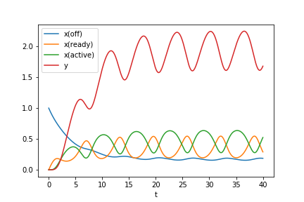
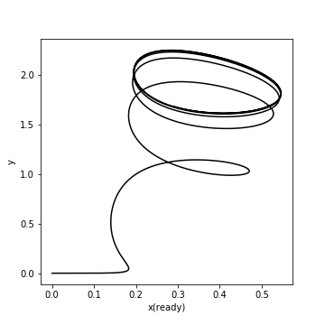

# Some dynamical system

```
d/dt x(off)    = constraint - k1 x(off) + k2 x(ready)
d/dt x(ready)  = constraint + k1 x(off) - k2 x(ready) - k3 x(ready) + k4 x(active) + activator(t)
d/dt x(active) = constraint + k3 x(ready) - k4 x(active) - k5 x(active)
d/dt y         = k5 x(active) - k6 y

constraint   = -k7 (x(off) + x(ready) + x(active) - 1)
activator(t) = A (1 - cos(omega t))
```

## Results

Timecourse:



Trajectory of `(x(ready), y)`:


