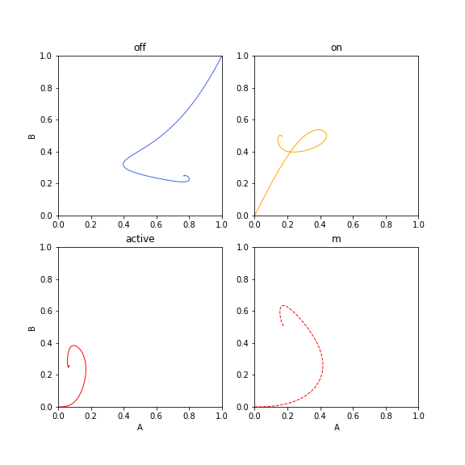

Dynamical system consisting of two switches: `A` and `B`. Each switch changes
its internal state among `off`, `on` and `active` following a master equation.
When a switch is `active` it produces interaction agent `mX` (X = A or B).
`mA` causes transition `B:on -> B:active`. Meanwhile, `mB` causes transition
`A:on -> A:off`, thus forming a negative feedback loop. So, the system would
oscillate, but how this three-state and indirect setting affect the oscillation?

```
  A -------+
  | off    |           B -------+
  | on   (-)<------+   | off    |
  | active-----+   |   | on   (+)<----+
  +--------+   |   |   | active----+  |
               |   |   +--------+  |  |
               |   |               |  |
               |   +- mB <---------+  |
               |                      |
               +--> mA ---------------+
```

Hand-tweaked a bit but I couldn't find a set of parameters that causes
oscillation. Anyway, the trajectory converges to a probable attractor.
See the sort-of-interesting trajectory plot below.


