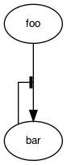

# Graphviz: Edge towards another edge

Put an invisible dummy node between connected nodes. Invisible node can be
produced by making the dummy node a zero-width point (`none` style does not
work; it leaves a small space).

The following diagram depicts a negative feedback reaction.

