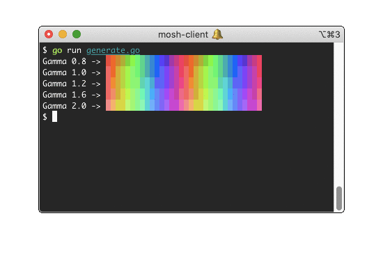

Generate rainbow ANSI escape code sequence.

```console
$ go get github.com/tomnomnom/xtermcolor
$ go run generate.go
```



- Set foreground color: `ESC [ 38; 5; CODE m`
- Set background color: `ESC [ 48; 5; CODE m`

16-step palettes:

```
gamma = 1 : [ 203, 202, 178, 148, 118, 83, 47, 42, 37, 32, 27, 63, 93, 128, 163, 197 ]
gamma = 2 : [ 210, 215, 184, 184, 155, 119, 84, 85, 44, 75, 69, 99, 135, 164, 164, 205 ]
```
