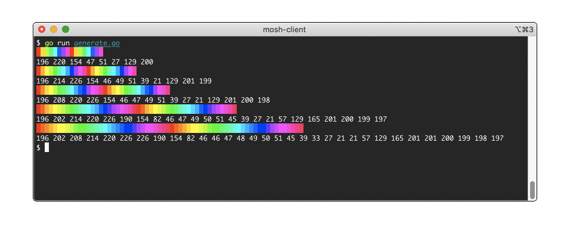

Showing rainbow colors on xterm only using 216 colors in the 6x6x6 cube.

```console
$ go run generate.go
```



- Set foreground color: `ESC [ 38; 5; CODE m`
- Set background color: `ESC [ 48; 5; CODE m`

Palettes:

```
8-step   196 220 154 47 51 27 129 200
12-step  196 214 226 154 46 49 51 39 21 129 201 199
16-step  196 208 220 226 154 46 47 49 51 39 27 21 129 201 200 198
24-step  196 202 214 220 226 190 154 82 46 47 49 50 51 45 39 27 21 57 129 165 201 200 199 197
32-step  196 202 208 214 220 226 226 190 154 82 46 46 47 48 49 50 51 45 39 33 27 21 21 57 129 165 201 201 200 199 198 197
```

Example script using the 16-step palette:

```console
$ ./rainbow.sh
```
