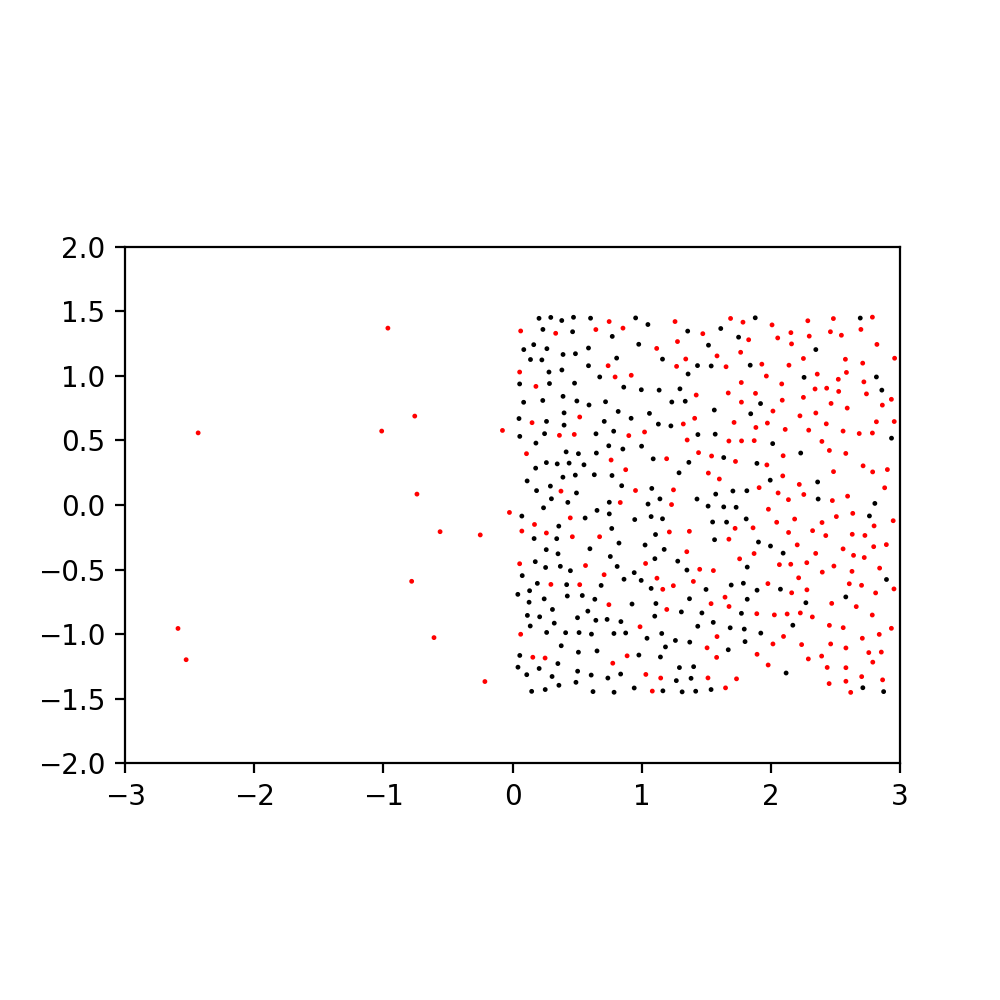
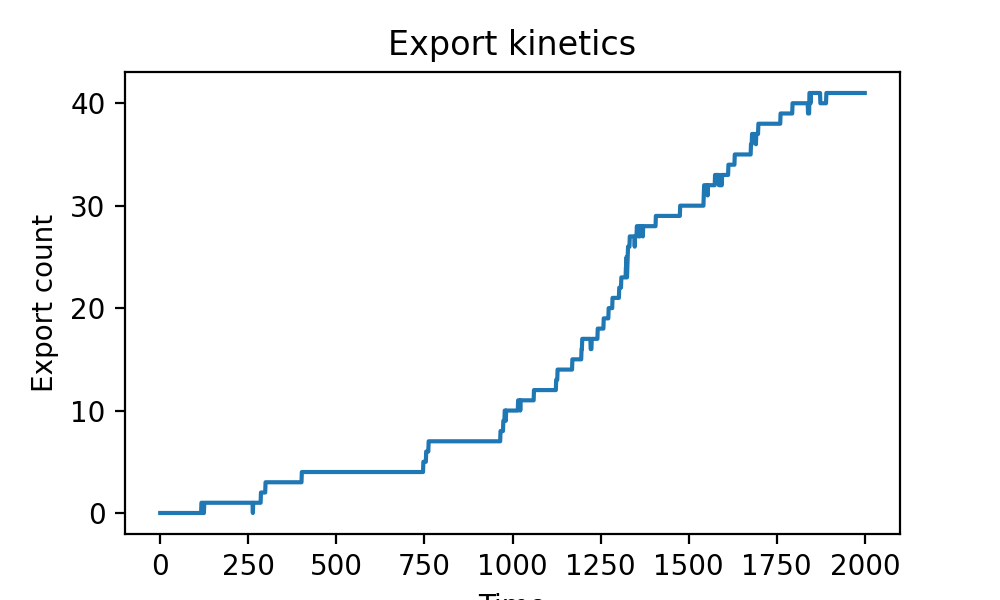

# Gas export simulation

Simulate Brownian dynamics of slow "structure" particles and fast "carrier"
particles in a two-dimensional box. The carrier particles are exported out
of the box at small exhaust point at (x, y) = (0, 0). See snapshot picture
below:

Black points are structure particles and red points are carrier ones.

This is not essential but "gravitational force" towards (x, y) = (-1, 0)
acts on the structure particles to make sure the structure particles fill
the left half of the box.

Here is the export kinetics of the carrier particles.

Carrier particles finds a way to the exhaust point around time 1,000 and
very quickly exported afterwards.

The spontaneous export of carrier particles is a trivial consequence of
thermodynamics. The driving mechanism is the chemical potential difference 
between the interior and the exterior of the box. But, the kinetics looks
non-trivial to me. Maybe the phenomenon can be understood as a
[percolation][perc] or something.

[perc]: https://en.wikipedia.org/wiki/Percolation
